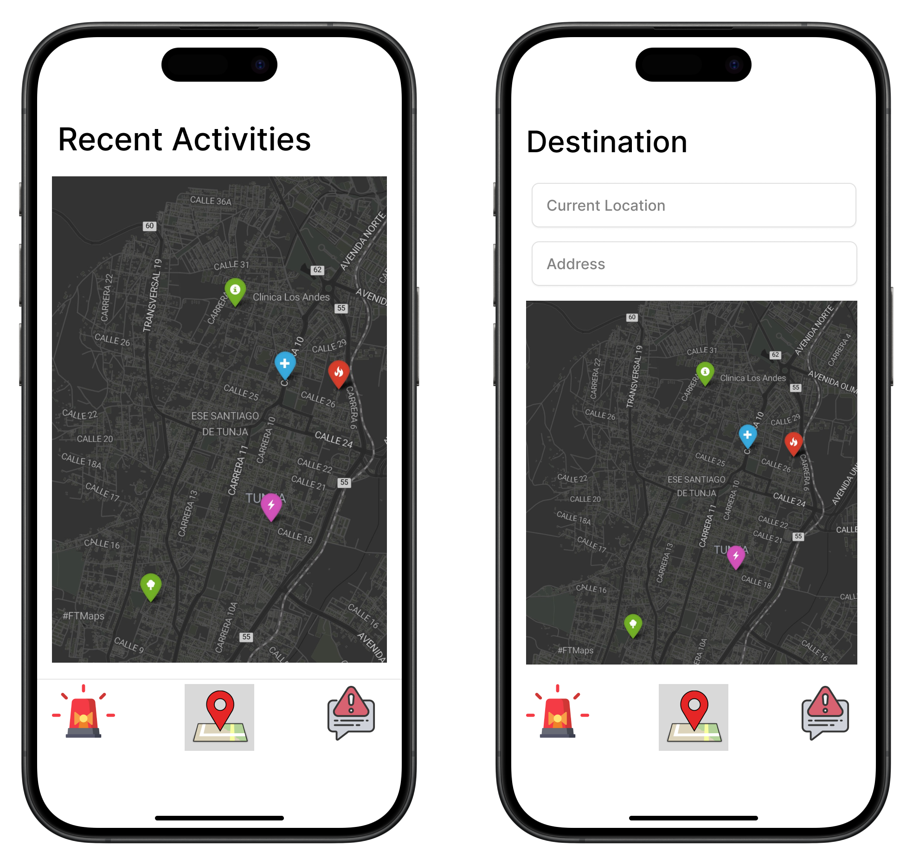
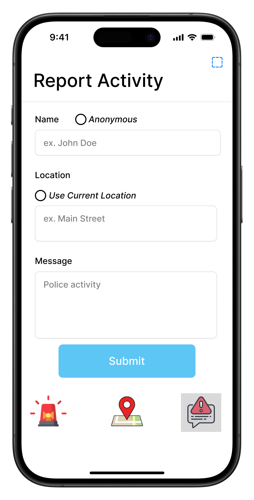
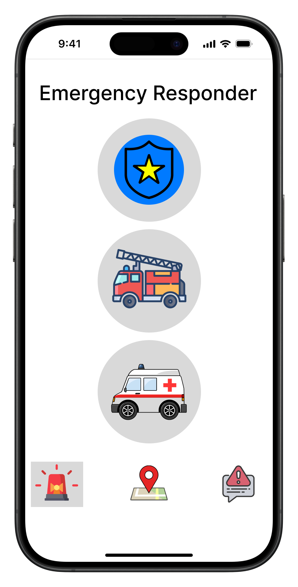

# Street Guardian

Street Guardian is a mobile application that allows users to report and view incidents in their area

## Description

To sign up, users only need their phone number. Once logged in, the app will display a map view with all the recent activities in the area.

User can report an incident by clicking on the report icon and filling out a form. The form includes a description of the incident, the type of incident. User can submit reports anonymously.

User can also connect with emergency services by clicking on the emergency icon. This will connect the user to emergency services from the app.

